Exporting your game manually to multiple platforms can be a tedious task,
especially if you to do it every time you make a change. The time and effort
required can be very easy to put off exports until the last possible moment
before release. While putting off exports is understandable, having up-to-date
builds for each supported platform enables you to easily distribute your game
for testing or feedback the whole way through development. This allows for
faster iteration and can help catch bugs. In this article, we will work though
the process of automating our Godot exports using GitHub Actions.

### Prerequisites

In order to export your game we must first set up an export preset in Godot.
This is done simply through the Godot editor on your local machine. To create an
export preset, open the project you want to export and go to `Project` >
`Export`

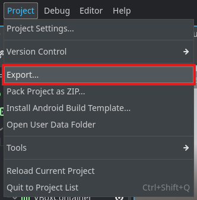

In the export window, click `Add...` and select the platform you want to export
to. For this example, we will be exporting to `Web` so that we can deploy to
GitHub Pages.

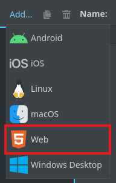

After adding your export preset, you can configure it all you want, but for this
example, we will be using the default settings. Take note of the export preset
name, as we will need it later. In this example, we will be using the default
name of `Web` but you can name it whatever you want. In addition we need to
configure the export path. This is the path where the exported files will be
saved. For this example, we will be using `build/web/index.html`.

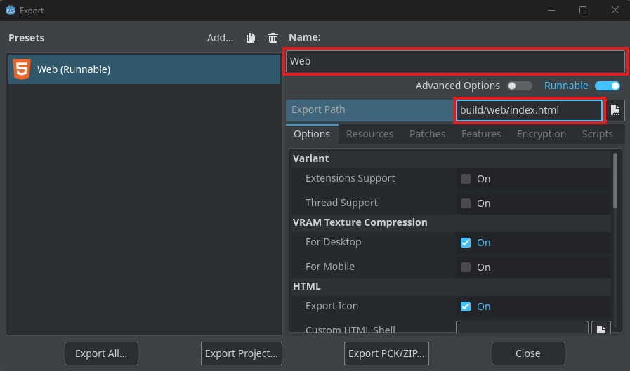

After following the above steps, there should be a new file in your project
directory called `export_presets.cfg`. This file contains all the information
needed for the export process, including the export preset name, the target
platform, and any additional settings you may have configured.

### GitHub Workflow v1 (Getting Started)

Now that we have our export preset set up, we can create a GitHub Actions
workflow to automate the export process. To do this, create a new file in your
`.github/workflows`. You can name this file whatever you want, but for this
example, we will name it `export.yaml`. The file should be located at
`.github/workflows/export.yaml`.

To start we need to configure some metadata for our workflow. Specifically we
need to tell GitHub when to run the workflow. In the future I will cover git hub
action events in more detail, but for now we will configure the workflow to be
triggered by the `workflow_dispatch` event. This event can be dispatched
manually through the GitHub website which will reduce the complexity of our
implementation for now. Additionally it allows us to pass in inputs to the
workflow which is useful for allowing reuse of the workflow without changing the
file. For now we will allow choosing the version of Godot.

```yaml
# this is the name that will be displayed in the GitHub Actions UI
name: Godot Export
on:
  workflow_dispatch:
    inputs:
      # we can add any inputs we want here
      godot-version:
        description: "The version of Godot to use"
        # the type can be string, number, boolean, or choice
        type: choice
        required: true
        default: "4.4"
        options:
          - "4.4"
          - "4.3"
```

Next we need to configure the job that will run our export. For this example,
we'll be building on `ubuntu-latest` but you could use any linux runner you
like. The runner does not come pre set up to build Godot so we will need to
install Godot ourselves. To do this we will have to do the following:

- Download the project files from our repository. This is done using the
  `actions/checkout` action.
- Download the Godot executable from the release in the official GitHub
  repository and extract it. To download the release easier we will use the
  `robinraju/release-downloader` action.
- Download the export templates for the platform we are exporting to. These is
  available in a release from official Godot repository as well.

```yaml
jobs:
  export:
    # this is the name that will be displayed in the GitHub Actions UI
    name: Export
    # this is the OS that will be used to run the job
    runs-on: ubuntu-latest
    env:
      ENGINE_FILE: Godot_v${{ inputs.godot-version }}-stable_linux.x86_64
      TEMPLATE_ZIP: Godot_v${{ inputs.godot-version }}-stable_export_templates.tpz
      # this is the path where the templates will be extracted to
      TEMPLATE_DIR: ~/.local/share/godot/export_templates/${{ inputs.godot-version }}.stable
    steps:
      - name: Checkout Code
        uses: actions/checkout@v4
        with:
          # this will check out the branch that triggered the workflow
          ref: ${{ github.head_ref || github.ref_name }}

      - name: Download Godot
        uses: robinraju/release-downloader@v1
        with:
          repository: godotengine/godot
          tag: ${{ inputs.godot-version }}-stable
          filename: ${{ env.ENGINE_FILE }}.zip
          # this will extract the zip file after downloading it
          extract: true

      - name: Make Godot Executable
        # we renamed the file for ease of use and make it executable
        shell: bash
        run: |
          mv ${{ env.ENGINE_FILE }} godot_stable_linux.x86_64
          chmod +x godot_stable_linux.x86_64

      - name: Download Godot Templates
        uses: robinraju/release-downloader@v1
        with:
          repository: godotengine/godot
          tag: ${{ inputs.godot-version }}-stable
          filename: ${{ env.TEMPLATE_ZIP }}

        # extract the templates to the location where Godot expects them
      - name: Extract Godot Templates
        shell: bash
        run: |
          mkdir -p ${{ env.TEMPLATE_DIR }}
          unzip -j ${{ env.TEMPLATE_ZIP }} templates/* -d ${{ env.TEMPLATE_DIR }}
```

Now that we have downloaded Godot and our project files, we can add a step to
export our game. We have to remember to create the directory where we configured
the export preset to save the files.

```yaml
jobs:
  export:
    ...
    steps:
      ...
      - name: Export Project
        shell: bash
        env:
          # this is the name of the export preset we created earlier
          EXPORT_PRESET: Web
        run: |
          mkdir -p build/web
          ./godot_stable_linux.x86_64 --headless --verbose \
            --export-release "${{ env.EXPORT_PRESET }}"
```

Finally we need to upload the exported files as an artifact. This will allow us
to download the files from the GitHub Actions UI. We will use the
`actions/upload-artifact` action to do this. The artifact `name` specifies the
name of the zip file that gets uploaded.

```yaml
jobs:
  export:
    ...
    steps:
      ...
      - name: Upload Artifact
        uses: actions/upload-artifact@v4
        with:
          name: web
          path: build/web
```

Putting it all together, our workflow file should look like
[this](./export_v1.yaml)

After committing and pushing these changes, we have a fully functional workflow
that will export our game for the web. To test it out, go to the `Actions` tab
in your GitHub repository.

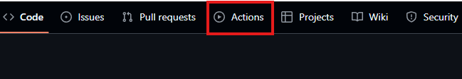

You should see the workflow we just created.

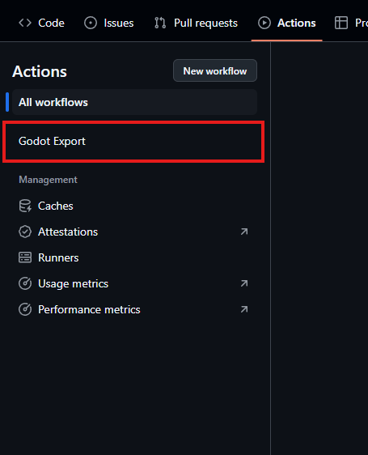

Click on the workflow and then click on the `Run workflow` button.

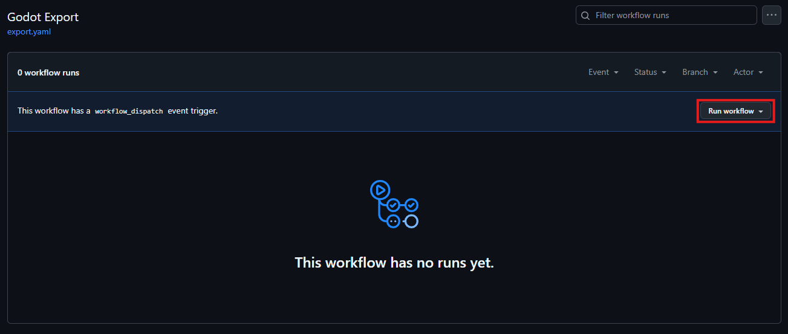

You can change the inputs if you want, but I will leave them as the defaults we
set. Click the second `Run workflow` button and wait a second for the workflow
run to start.

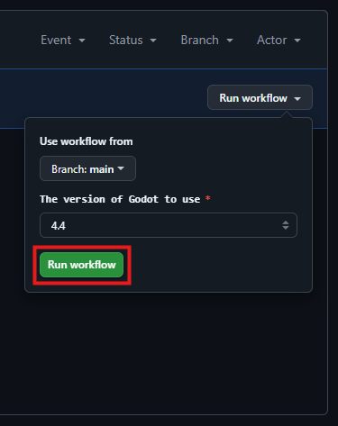

After a bit or after reloading you should see the workflow running like so.

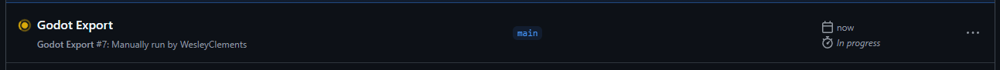

Click on the workflow run to see the details such as the output of each step.
After all the steps have run successfully, you should see a green check mark
next to the workflow run. This means that the workflow has completed
successfully. At the bottom of the summary page, you should see a section called
`Artifacts`. Click on the `web` artifact to download the exported files.

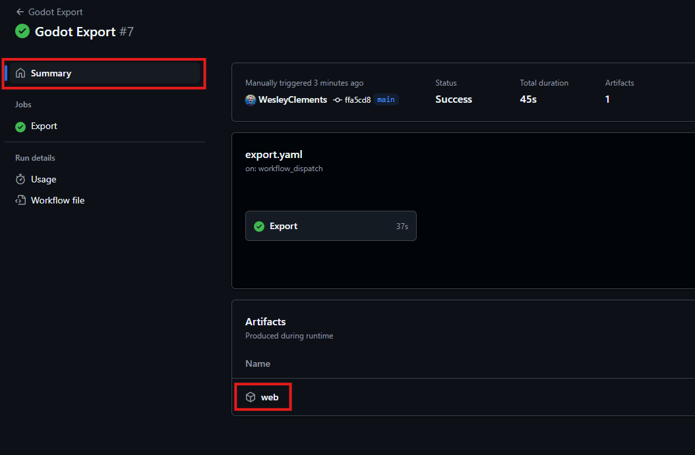

If instead of a green check mark you see a red X, this means that the workflow
has failed. Click on the job that failed to see the details and find out what
went wrong.

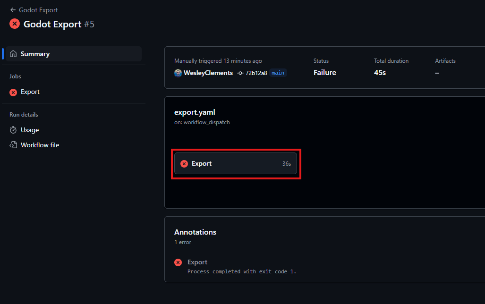

Most likely the issue is either that you didn't create the export preset in
Godot or you didn't set the export path.

### GitHub Workflow v2 (Multiple Platforms)

The above workflow is a great but right now it only exports one platform. Let's
change it so that it creates a build for windows as well. To do this we have to
create another export preset in Godot. This is done the same way as before, but
this time add a preset for `Windows Desktop`. You can name it whatever you want,
but for this example, we use the default name of `Windows Desktop`. Make sure to
also set the export path. We will be setting it to `build/windows/game.exe` for
this example.

After creating the export preset, we need to refactor our export job to use a
matrix strategy. This will allow us to run the same job in some variations.
Replace the `export` job with the following

```yaml
...
jobs:
  export:
    name: Export
    runs-on: ubuntu-latest
    strategy:
      matrix:
        # contains variations in configuration for the export job
        export:
          - preset: Web
            path: build/web
            artifact-name: web
          - preset: Windows Desktop
            path: build/windows
            artifact-name: windows
    env:
      ENGINE_FILE: Godot_v${{ inputs.godot-version }}-stable_linux.x86_64
      TEMPLATE_ZIP: Godot_v${{ inputs.godot-version }}-stable_export_templates.tpz
      TEMPLATE_DIR: ~/.local/share/godot/export_templates/${{ inputs.godot-version }}.stable
    steps:
      - name: Checkout Code
        uses: actions/checkout@v4
        with:
          ref: ${{ github.head_ref || github.ref_name }}

      - name: Download Godot
        uses: robinraju/release-downloader@v1
        with:
          repository: godotengine/godot
          tag: ${{ inputs.godot-version }}-stable
          filename: ${{ env.ENGINE_FILE }}.zip
          extract: true

      - name: Make Godot Executable
        shell: bash
        run: |
          mv ${{ env.ENGINE_FILE }} godot_stable_linux.x86_64
          chmod +x godot_stable_linux.x86_64

      - name: Download Godot Templates
        uses: robinraju/release-downloader@v1
        with:
          repository: godotengine/godot
          tag: ${{ inputs.godot-version }}-stable
          filename: ${{ env.TEMPLATE_ZIP }}

      - name: Extract Godot Templates
        shell: bash
        run: |
          mkdir -p ${{ env.TEMPLATE_DIR }}
          unzip -j ${{ env.TEMPLATE_ZIP }} templates/* -d ${{ env.TEMPLATE_DIR }}

        # this will run the export for each preset in the matrix
      - name: Export Project
        shell: bash
        run: |
          mkdir -p ${{ matrix.export.path }}
          ./godot_stable_linux.x86_64 --headless --verbose \
            --export-release "${{ matrix.export.preset }}"

      - name: Upload Artifact
        uses: actions/upload-artifact@v4
        with:
          # this is the name of the artifact that will be created
          name: ${{ matrix.export.artifact-name }}
          # this is the path to the exported files
          path: ${{ matrix.export.path }}
```

If we commit and push these changes, we will now have a workflow that exports
our game for both the web and windows. The workflow will run the export job
twice, once for each variation of `export` object in the matrix. We could easily
add more export presets to the matrix to support additional platforms or
configurations.

All together, our workflow file should look like [this](./export_v2.yaml)

There is one big problem that has become more apparent as a result of building
the game multiple times per workflow run. We're doing a lot of extra work
downloading and extracting the Godot executable and export templates every time
we run the workflow. On most runs it adds up to 30 seconds to the export time
and with two runs, that's a full minute of wasted time. We can fix this by
caching the Godot executable and export templates before we run our export
matrix.

### GitHub Workflow v3 (Caching Godot)

What we want to do is check to see if the Godot executable and export templates
are already cached. If they are, we will use the cached version instead of
downloading them again. If they aren't, we will download them and cache them for
future use. We will need a new job to handle this and for good measure we can
add one for both the Godot executable and the export templates. This will allow
us to download and cache them in parallel. To check if the cache exists we'll
use the `actions/cache/restore` action and to save the cache we'll use the
`actions/cache/save` action.

```yaml
...
env:
  # moved this to the top so we can use it in the cache path
  TEMPLATE_DIR: ~/.local/share/godot/export_templates/${{ inputs.godot-version }}.stable
jobs:
  cache-engine:
    name: Cache Godot Engine
    runs-on: ubuntu-latest
    env:
      ENGINE_FILE: Godot_v${{ inputs.godot-version }}-stable_linux.x86_64
    outputs:
      # this can be used in subsequent jobs to restore the cache
      cache-key: ${{ steps.restore-engine-cache.outputs.cache-primary-key }}
    steps:
      - name: Restore Engine Cache
        id: restore-engine-cache
        uses: actions/cache/restore@v4
        with:
          path: godot_stable_linux.x86_64 # the path of the files to cache
          # this is the name of the cache
          key: ${{ runner.os }}-godot-${{ inputs.godot-version }}-engine
          lookup-only: true # this will check for the cache but not download it

      - name: Download Godot
        # this will only run if the cache was not found
        if: steps.restore-engine-cache.outputs.cache-hit != 'true'
        uses: robinraju/release-downloader@v1
        with:
          repository: godotengine/godot
          tag: ${{ inputs.godot-version }}-stable
          filename: ${{ env.ENGINE_FILE }}.zip
          extract: true

      - name: Make Godot Executable
        # this will only run if the cache was not found
        if: steps.restore-engine-cache.outputs.cache-hit != 'true'
        shell: bash
        run: |
          mv ${{ env.ENGINE_FILE }} godot_stable_linux.x86_64
          chmod +x godot_stable_linux.x86_64

      - name: Save Engine Cache
        # this will only run if the cache was not found
        if: steps.restore-engine-cache.outputs.cache-hit != 'true'
        uses: actions/cache/save@v4
        with:
          path: godot_stable_linux.x86_64
          key: ${{ steps.restore-engine-cache.outputs.cache-primary-key }}

  cache-templates:
    name: Cache Godot Templates
    runs-on: ubuntu-latest
    env:
      TEMPLATE_ZIP: Godot_v${{ inputs.godot-version }}-stable_export_templates.tpz
    outputs:
      # this can be used in subsequent jobs to restore the cache
      cache-key: ${{ steps.restore-export-template-cache.outputs.cache-primary-key }}
    steps:
      - name: Restore Export Templates Cache
        id: restore-export-template-cache
        uses: actions/cache/restore@v4
        with:
          path: | # we only care about the release templates
            ${{ env.TEMPLATE_DIR }}/*release*
            ${{ env.TEMPLATE_DIR }}/ios.zip
            ${{ env.TEMPLATE_DIR }}/macos.zip
          key: ${{ runner.os }}-godot-${{ inputs.godot-version }}-export-templates
          lookup-only: true

      - name: Download Godot Templates
        # this will only run if the cache was not found
        if: steps.restore-export-template-cache.outputs.cache-hit != 'true'
        uses: robinraju/release-downloader@v1
        with:
          repository: godotengine/godot
          tag: ${{ inputs.godot-version }}-stable
          filename: ${{ env.TEMPLATE_ZIP }}

      - name: Extract Godot Templates
        # this will only run if the cache was not found
        if: steps.restore-export-template-cache.outputs.cache-hit != 'true'
        shell: bash
        run: |
          mkdir -p ${{ env.TEMPLATE_DIR }}
          unzip -j ${{ env.TEMPLATE_ZIP }} templates/* -d ${{ env.TEMPLATE_DIR }}

      - name: Save Export Templates Cache
        # this will only run if the cache was not found
        if: steps.restore-export-template-cache.outputs.cache-hit != 'true'
        uses: actions/cache/save@v4
        with:
          path: |
            ${{ env.TEMPLATE_DIR }}/*release*
            ${{ env.TEMPLATE_DIR }}/ios.zip
            ${{ env.TEMPLATE_DIR }}/macos.zip
          key: ${{ steps.restore-export-template-cache.outputs.cache-primary-key }}
...
```

We have to update our export job to depend on the cache jobs. This is done using
the `needs` property. This will make sure that the export job will only run
after the cache jobs have completed. We also need to change it to use the cached
version of the Godot executable and export templates.

```yaml
...
jobs:
  ...
  export:
    name: Export
    # this job will run after the cache jobs
    needs: [cache-engine, cache-templates]
    runs-on: ubuntu-latest
    strategy:
      matrix:
        export:
          - preset: Web
            path: build/web
            artifact-name: web
          - preset: Windows Desktop
            path: build/windows
            artifact-name: windows
    steps:
      - name: Checkout Code
        uses: actions/checkout@v4
        with:
          ref: ${{ github.head_ref || github.ref_name }}

      - name: Restore Engine Cache
        uses: actions/cache/restore@v4
        with:
          # the path of the files to cache
          path: godot_stable_linux.x86_64
          # use the cache key from the previous job
          key: ${{ needs.cache-engine.outputs.cache-key }}
          # this will fail the job if the cache is not found
          fail-on-cache-miss: true

      - name: Restore Export Templates Cache
        uses: actions/cache/restore@v4
        with:
          # we only care about the release templates
          path: |
            ${{ env.TEMPLATE_DIR }}/*release*
            ${{ env.TEMPLATE_DIR }}/ios.zip
            ${{ env.TEMPLATE_DIR }}/macos.zip
          # use the cache key from the previous job
          key: ${{ needs.cache-templates.outputs.cache-key }}
          # this will fail the job if the cache is not found
          fail-on-cache-miss: true

      - name: Export Project
        shell: bash
        run: |
          mkdir -p ${{ matrix.export.path }}
          ./godot_stable_linux.x86_64 --headless --verbose \
            --export-release "${{ matrix.export.preset }}"

      - name: Upload Artifact
        uses: actions/upload-artifact@v4
        with:
          name: ${{ matrix.export.artifact-name }}
          path: ${{ matrix.export.path }}
```

With that we should pretty drastically reduce the time it takes to run our
workflow. All together, our workflow file should look like
[this](./export_v3.yaml)

Now the biggest problem with our current implementation is that we are having to
manually specify the export presets and paths even though they are already
specified in `export_presets.cfg`. This makes it very easy to break our workflow
if we change the name of the export preset or the export path. To fix this, we
will need to dynamically create the matrix based on the export presets in the
`export_presets.cfg` file.

### GitHub Workflow v4 (Dynamic Matrix)

To dynamically create the matrix, we will need to add a new job that will run
before the export job. This job will read the `export_presets.cfg` file and
create an array of export presets objects. This python script will do exactly
that.

```python
import os
import json
import re

# read the export_presets.cfg file
with open("export_presets.cfg", "r") as f:
  lines = f.readlines()

# this will hold the export presets
export_presets = []

# parse the file and create a list of export presets
for line in lines:
  if line.strip() == "": # skip empty lines
    continue

  # check if the line is a preset marker
  match = re.match(r"^\[preset\.(\d+)\]$", line)
  if match:
    preset_index = int(match.group(1))
    preset_name = None
    export_path = None
    continue

  # check if the line is a key-value pair
  match = re.match(r"^(.+)=\"(.*)\"$", line)
  if match:
    key = match.group(1)
    value = match.group(2)
    match key:
      case "name":
        preset_name = value
      case "export_path":
        export_path = value

  # if we don't have both a preset name or export path yet continue
  if preset_name == None or export_path == None:
    continue

  if preset_name == "":
    # skip if preset name is empty
    print(
      "::warning"
      f"::Skipped Preset {preset_index} \"\""
      ": name is empty"
    )
  elif export_path == "":
    # skip if export path is empty
    print(
      "::warning"
      f"::Skipped Preset {preset_index} \"{preset_name}\""
      ": export_path is empty"
    )
  else:
    # add the preset to the matrix
    export_presets.append({
      "preset": preset_name,
      "path": os.path.dirname(export_path),
      # we will generate the artifact name from the preset name
      "artifact-name": preset_name.lower().replace(" ", "-")
    })

  # reset the preset name and export path
  preset_name = None
  export_path = None

matrix = {
  "export": export_presets
}

# Print the matrix for debugging
print(matrix)

# write the export presets to the job output
with open(os.environ["GITHUB_OUTPUT"], "w") as f:
  f.write(f"matrix={json.dumps(matrix, separators=(',', ':'))}\n")
```

We can add this script directly to our workflow file as part of our new job. We
have to remember to set this job to output the result of the step that runs the
script.

```yaml
...
jobs:
  parse-export-presets:
    name: Parse Export Presets
    runs-on: ubuntu-latest
    outputs:
      # this will be used as the input for the matrix strategy
      matrix: ${{ steps.parse.outputs.matrix }}
    steps:
      - name: Checkout Code
        uses: actions/checkout@v4
        with:
          ref: ${{ github.head_ref || github.ref_name }}

      - name: Parse Export Presets
        # this will be used to get the output of the step
        id: parse
        shell: python
        run: |
          import os
          import json
          import re

          ...

          with open(os.environ["GITHUB_OUTPUT"], "w") as f:
            f.write(f"matrix={json.dumps(matrix, separators=(',', ':'))}\n")
...
```

We can now update our export job to use the matrix from the previous job.

```yaml
...
jobs:
  parse-export-presets:
    ...
  export:
    name: Export
    # this job will run after the parse-export-presets job
    needs: [cache-engine, cache-templates, parse-export-presets]
    runs-on: ubuntu-latest
    strategy:
      # this will use the matrix from the previous job
      matrix: ${{ fromJson(needs.parse-export-presets.outputs.matrix) }}
    steps:
      ...
```

All together, our workflow file should look like [this](./export_v4.yaml)

And it's really as simple as that. Go ahead and commit and push these changes to
your repository. After the workflow has run successfully, you should see that
the export job has run for each export preset in the `export_presets.cfg` file.
You can add as many export presets as you want and the workflow will
automatically pick them up. We aren't set up to deploy for all platforms yet
(MacOS is a bit tricky), but we'll have to address that at a later time.

The last thing we need to cover is see how to utilize the artifacts we just
exported.

### Deploying to GitHub Pages

To do deploy to GitHub pages, we will add a new job that will run after the
export job has completed.

This job will use the `actions/deploy-pages` action to deploy the files to
GitHub Pages. Unfortunately the artifact we just created can't be used directly
as GitHub Pages is expecting it to be structured in a specific way. Instead we
will download the artifact we just created and then upload a new artifact using
the `actions/upload-pages-artifact` action.

```yaml
jobs:
  ...
  deploy-gh-pages:
    name: Deploy to GitHub Pages
    # this job will run after the export job
    needs: [export]

    # this is required to deploy to GitHub Pages
    permissions:
      pages: write
      id-token: write

    # this creates a deployment environment on GitHub that points to the GitHub Pages URL
    environment:
      name: github-pages
      url: ${{ steps.deployment.outputs.page_url }}

    runs-on: ubuntu-latest
    steps:
      - name: Download Artifacts
        uses: actions/download-artifact@v4
        with:
          name: web
          # this is the path that actions/upload-pages-artifact@v3 uploads by default
          path: _site

      - name: Upload GitHub Pages Artifact
        uses: actions/upload-pages-artifact@v3

      - name: Deploy to GitHub Pages
        id: deployment
        uses: actions/deploy-pages@v4
```

All together, our workflow file should look like [this](./export_v4_pages.yaml)

We can commit and push these changes to our repository but before we can test it
out, we need to make sure that GitHub Pages is enabled for our repository. To do
this, go to the `Settings` tab of your repository.

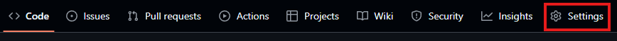

Scroll down to the `Pages` section and change the source to GitHub Actions.

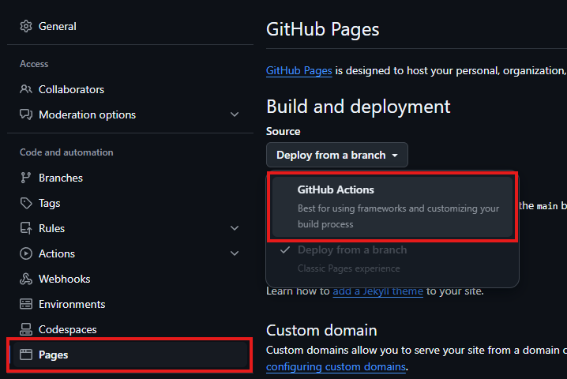

After enabling GitHub Pages, we can go back to the `Actions` tab and run the
workflow again. After the workflow has run successfully, you should the Deploy
to GitHub Pages job should have a link to the deployed site.

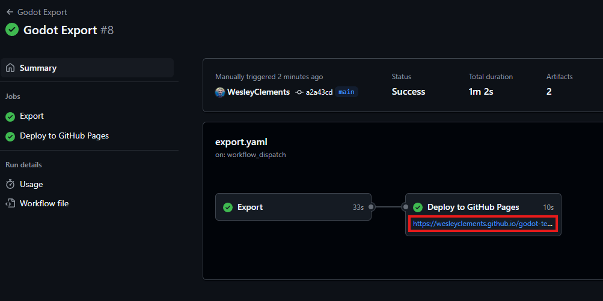

At this point you should be able to click the link and see your game running in
the browser. GitHub Pages is a great way to host your game for free though it
currently only allows one deployment per repository. This means you can't use it
to preview changes to your game before they are merged into the main branch for
example.

### Conclusion

In this article, we covered how to automate the export process for your Godot
game using GitHub Actions. We started with a simple workflow that exported our
game for one platform and then added support for multiple platforms. We also
covered how to cache the Godot executable and export templates to speed up the
export process. We even delved into parsing the export presets file to
dynamically create a matrix for our export job. Finally, we covered how to
deploy our game to GitHub Pages using the artifacts we exported. I hope this
will give you a good starting point for automating your Godot exports and
deploying your game. If you have any questions or suggestions feel free to send
an email.

### Workflow Files

- [Export v1](./export_v1.yaml)
- [Export v2](./export_v2.yaml)
- [Export v3](./export_v3.yaml)
- [Export v4](./export_v4.yaml)
- [Export v4 with Pages](./export_v4_pages.yaml)
